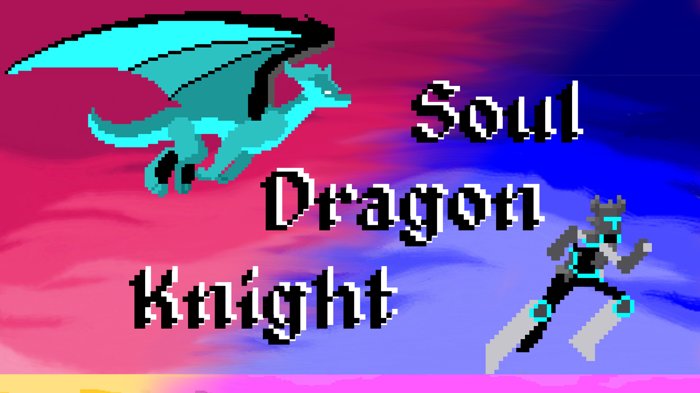
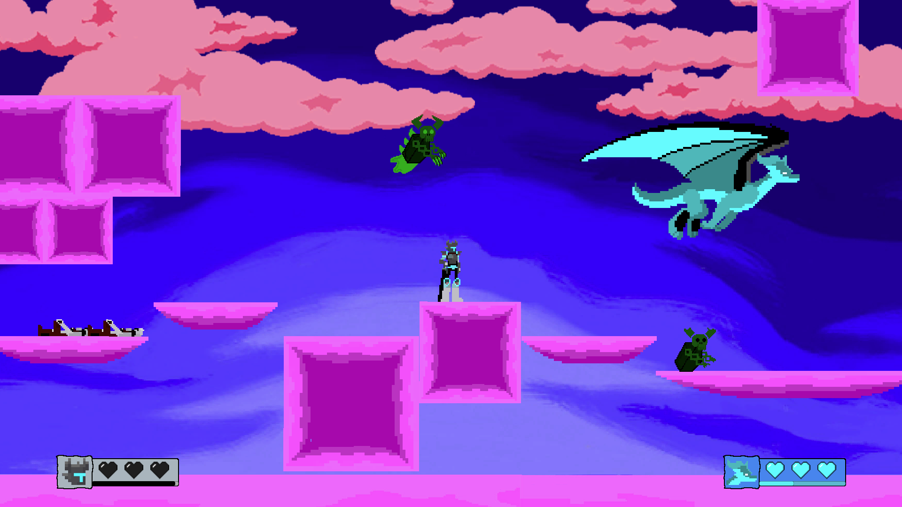
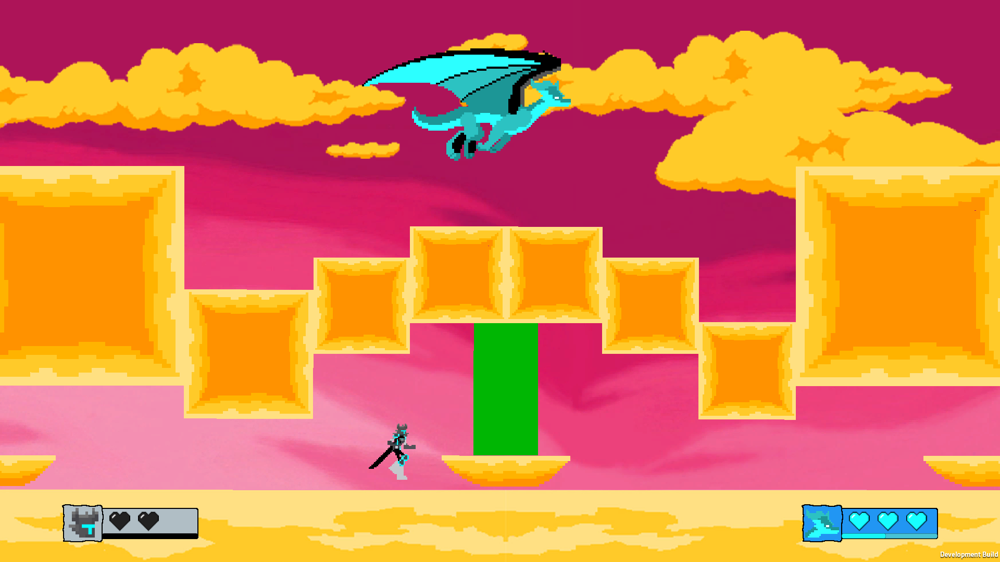
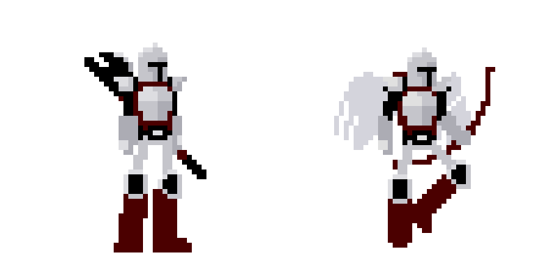
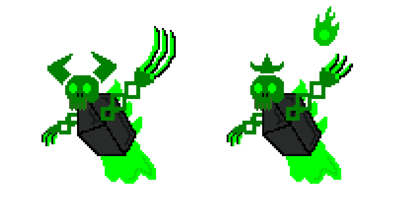

#  Soul Dragon Knight

Developed by Team Socialize for NUS CS3247: Game Development using Unity 2020.3.26f1

When a benevolent King's rule is overthrown by his scheming brother in a coup, the young Prince and his Soul Dragon companion must embark on an epic quest to defeat the tyrant and save his parents.

You and your friend will play as the young Prince and the Soul Dragon. Your job is to defeat all enemies and solve puzzles to save your parents. However, the interesting thing is the Prince has soul eyes while his Soul Dragon has normal eyes. Hence, each player will only be able to see the enemies that are targeting their partner. You must work closely with your partner to help them defeat the enemies they cannot see - just as they will help you!

Trailer: [https://www.youtube.com/watch?v=qphiPRm8LQU](https://www.youtube.com/watch?v=qphiPRm8LQU)

## Contents
  * [Gameplay](#gameplay)
  * [Requirements](#requirements)
  * [Download Instructions](#download-instructions)
  * [Creating and Joining a Room](#creating-and-joining-a-room)
  * [Control Instructions](#control-instructions)
      - [Knight](#knight)
      - [Dragon](#dragon)
  * [About Us](#about-us)

## Gameplay

### Different Worlds
- Depending on the character you choose, you will see a completely different world.
- The Knight (Young Prince) will see the soul world.

- The Soul Dragon will see the real world.

### Unique enemies
- Face off against our powerful AI enemies, each with unique abilities and attacks.
- Remember, you cannot see your enemies, so communication with your partner is very important.
- As the Knight, your enemies are:

- As the Dragon, your enemies are:

- You cannot attack enemies that are not targeting you.

## Requirements
- Space required: 100MB
- Platforms Supported: Windows 10, MacOS
- A separate platform such as Discord for voiced communication with your partner, as the game does not currently include any voice or text chat.

## Download Instructions
- Download the latest release for your platform (Windows 10, MacOS) [here]().
- Unzip the file.
- Ensure that you and your partner have a working internet connection and a platform for voice communication before launching the game.
- After the above setup is done, you and your partner can run the executable with name "Soul Dragon Knight" to launch the game.

## Creating and Joining a Room
- Upon launching the game, both players must enter a room to play the game. On the menu
screen, one player first enters a room name of their choice before clicking “Create” to create a
new room. Once the room has been created, the other player can join that room by entering the
same room name and clicking “Join”.
- Each player now has the choice of who will play as the Knight and who will play as the Dragon.
The same role cannot be chosen by both players. Once each player has chosen their role, the
“Select Level” button should now be clickable and both players may proceed to the level select
screen.
- When selecting a level, both players must agree on a level to play. Currently, only Level 1 is
available. Once both players have selected the same level, the “Start Game” button should now
be clickable and both players may start the game.

## Control Instructions

### Knight
* A,D - Run
* Space - Jump
* Left Click - Melee Attack
* Right Click - Block
* E - Interact

### Dragon
* W,A,S,D - Fly
* Space - Dash
* Left Click - Horizontal Ranged Attack
* Right Click - Vertical Ranged Attack
* E - Interact

## About Us

### Kenneth Fung Chen Yu

* Roles: Programming, Level Design, Game Mechanics, UI, AI, Animation, Sound.

### Low Kang Ngee

* Roles: Programming, Level Design, Game Mechanics, UI, Sound, Trailer.

### Ng Tze Wei Bruce Mitchell

* Roles: Programming, Level Design, Animation, UI.

### Nguyen Duc Danh

* Roles: Original Game Concept, Programming, Concept Arts, Character Sprites, Other Sprites, Animation, UI, Sound, Project Homepage.

### Raja Dishafnya Achadi

* Roles: Character Sprites, Concept Arts, Animation.

### Yurtoglu Ayda

* Roles: Environment Art, Other Sprites, Poster.
